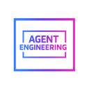

<div class="agenteng-hero" markdown>



<p class="agenteng-eyebrow">Conferences · Community · Tools</p>

# Agent Engineering HQ

<p class="agenteng-hero-tagline">The home of the agent engineering discipline.</p>

<p class="agenteng-hero-description">Meet the people, explore the tools and find the events shaping agent engineering. Take <strong>AgentEng</strong> with you, from your terminal to the coding agent you already use.</p>

<ul class="agenteng-highlights" aria-label="At a glance">
  <li>📍 London + San Francisco</li>
  <li>🧠 12 disciplines</li>
  <li>💻 CLI · MCP · A2A</li>
  <li>🔓 Open source</li>
</ul>

[🚀 Get started](#installation-and-first-run){ .md-button .md-button--primary }
[🤖 Connect your agent](INTEGRATIONS.md){ .md-button }
[🌍 Event website](https://agentengineering.world){ .md-button }

</div>

## 🧭 Find your starting point { #find-your-starting-point }

<div class="grid cards agenteng-cards" markdown>

-   **📅 Discover events**

    ---

    Find London and San Francisco events, speakers, sessions and official registration links.

    [Explore events →](#explore-events)

-   **🤖 Bring your coding agent**

    ---

    Connect through one MCP tool, A2A or HTTP. Use the same catalogue from your existing workspace.

    [Connect an agent →](INTEGRATIONS.md)

-   **🧰 Explore the tool directory**

    ---

    Browse 456 attributed tools, models and infrastructure listings across twelve disciplines.

    [Browse the directory →](TOOLS.md)

-   **💡 Shape a future event**

    ---

    Turn a talk, workshop or event idea into a local draft, then choose how to share it with the organizer.

    [Prepare an idea →](PARTICIPATION.md)

</div>

## 🚀 Installation and first run { #installation-and-first-run }

Install the latest AgentEng from PyPI. The one-liner installs the CLI with the
`server` extras (MCP + A2A). RLM stays optional and is not included.
The installer is served at [agentengineering.world/install.sh](https://agentengineering.world/install.sh)
and mirrored at [a2a.agentengineering.world/install.sh](https://a2a.agentengineering.world/install.sh).

```sh title="Install AgentEng"
curl -fsSL https://agentengineering.world/install.sh | sh
# Or: uv tool install --upgrade 'agenteng[server]'
ae                 # interactive menu on a TTY
ae discover
ae events --upcoming
ae events --json   # Result JSON for agents
ae connect cursor
```

**Your first result:** published London and San Francisco events as readable cards
(or Result JSON for agents), with supporting source links. The CLI uses its bundled
snapshot, so event lookup, tool browsing and local drafting work offline with
**zero model calls** and no provider key.

On a terminal, `ae` opens an interactive menu and commands render tables and cards.
Pass `--json`, set `AGENTENG_OUTPUT=json`, or pipe stdout to get the shared Result
JSON used by MCP and A2A. The package is named `agenteng`. The CLI commands are
`agenteng` and the short alias `ae`. This source tracks the **0.0.5 alpha** release.
Run `ae --help` to explore commands, or `ae COMMAND --help` for options.
Installing the CLI does not start or publish a hosted service.

## 📅 Explore events { #explore-events }

Find an event, then use its returned ID to explore the agenda, speakers or ticket
terms. Put global options such as `--json` before the command.

```sh title="Find your next event"
ae events --city London --upcoming
ae events --city 'San Francisco'
ae ask 'When is the next London conference?'
ae --json events
```

```sh title="Explore a published programme"
ae speakers --city London
ae speaker samuel-colvin
ae talks --search memory
ae talk samuel-colvin
ae agenda agenteng-london-2026 --topic memory
ae agenda agenteng-london-2026 --format ics --output london.ics
ae faq --search tickets
ae venue agenteng-london-2026
ae sponsors
ae conduct
ae themes
ae now agenteng-london-2026
ae next agenteng-london-2026
ae save samuel-colvin
ae my-agenda
ae tickets agenteng-london-2026
```

The catalogue is a dated snapshot. Follow the event's official registration link
for current availability and details. See [data and attribution](DATA.md).

## 🧠 Twelve disciplines, one directory { #the-twelve-disciplines }

Explore the tooling around the whole discipline, from prompts and memory to
protocols and inference. Listings include names, categories and source links;
they are not popularity rankings or tutorials.

<ul class="agenteng-disciplines" aria-label="Agent engineering disciplines">
  <li>✍️ Prompt</li>
  <li>🧩 Context</li>
  <li>⚙️ Harness</li>
  <li>📏 Eval</li>
  <li>🧠 Memory</li>
  <li>⚡ Inference</li>
  <li>🔄 Loop</li>
  <li>🤖 Agentic</li>
  <li>💻 Code</li>
  <li>🔌 Protocol</li>
  <li>🕸️ Graph</li>
  <li>🔎 Search</li>
</ul>

```sh title="Find tools for your work"
agenteng disciplines
agenteng tools --discipline memory
agenteng tools --discipline inference --kind runtime
agenteng tools --search 'Gemini CLI'
agenteng tool langgraph
```

[Explore filters, pagination and source attribution →](TOOLS.md)

## 🤖 Use AgentEng inside your agent { #connect-your-agent }

Add the installed executable to a client's local MCP configuration:

```json title="Local MCP configuration"
{
  "mcpServers": {
    "agenteng": {
      "command": "agenteng",
      "args": ["mcp"]
    }
  }
}
```

Try asking: **“Find the next London conference”**, **“List memory tools”** or
**“Help me draft a workshop idea for San Francisco.”**

Run `agenteng connect codex`, `agenteng connect claude-code` or
`agenteng connect cursor` for client-specific setup instructions.
[The connection guide](INTEGRATIONS.md) also covers hosted MCP, A2A and HTTP.

## 💡 Have an idea? Start with a draft { #share-an-idea }

A practical workshop, a talk you want to give, a topic the community should
explore: start small and shape the idea before sharing it.

```sh title="Prepare a future-event idea"
agenteng engage --city London --output draft.json
agenteng proposal preview draft.json
agenteng proposal export draft.json --format markdown --output draft.md
agenteng participate
```

These commands create local drafts and show organizer contact details; they do
not send a proposal. Ideas go to **one organizing group: Agent Engineering HQ**.
Sharing an idea does not guarantee a response, acceptance or an event. London
2026 has an invited programme and no public CFP.

[Drafting and the optional intake pilot →](PARTICIPATION.md)
[Community participation →](COMMUNITY.md)

## 🔓 Built in the open { #built-in-the-open }

Improve the code, suggest a source-backed tool correction or help make the docs
clearer. AgentEng shares one typed interface across CLI, MCP and A2A. Optional
model synthesis and RLM are disabled by default; RLM is bounded to depth one and
one child or leaf delegation.

<div class="agenteng-footer-links" markdown>

[⭐ View on GitHub](https://github.com/SuperagenticAI/agenteng){ .md-button }
[🤝 Contribute](https://github.com/SuperagenticAI/agenteng/blob/main/CONTRIBUTING.md){ .md-button }
[🏗️ Architecture](ARCHITECTURE.md){ .md-button }

</div>

<!-- docs-ci-retrigger -->
